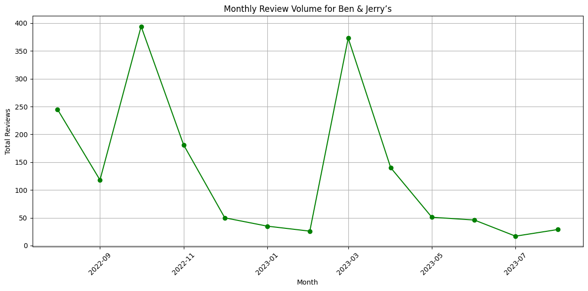
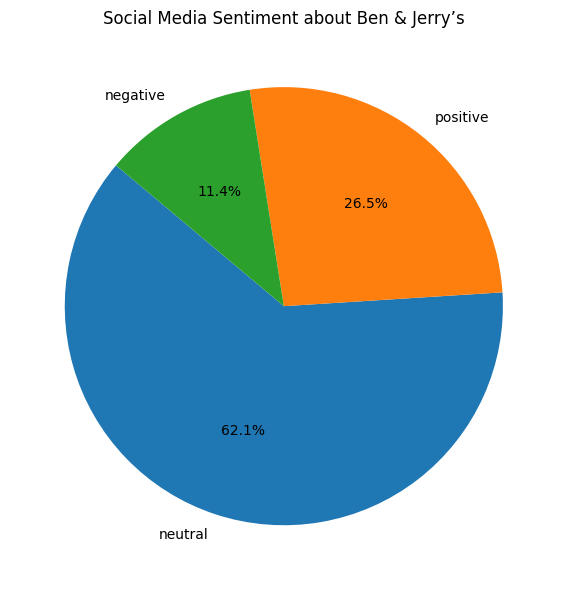
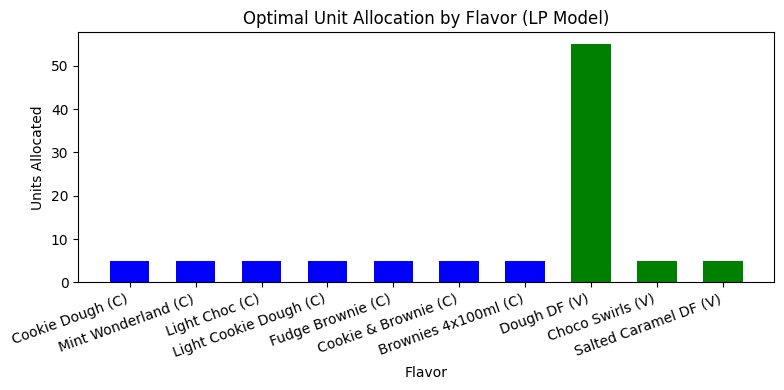

# Unilever Step-Up Project: Sentiment, Trends & Optimisation

This project was created as part of the **Unilever Step-Up Virtual Career Challenge** by Digdata.  
It explores customer preferences and ethical product strategy for Ben & Jerry’s using real-world data.

---

## 📊 Project Overview

Using datasets from e-commerce platforms and social media (Brandwatch), I explored how Ben & Jerry’s can blend classic ice cream favourites with modern dietary trends — especially rising demand for vegan options.

---

## 🔧 Tools & Techniques Used

- Data Cleaning & Analysis (Python / Pandas)
- Time Series Analysis (Matplotlib)
- Sentiment Analysis (Brandwatch data)
- Linear Programming (SciPy)
- Data Visualisation (Matplotlib, Canva)
- Presentation (PowerPoint)

---

## 🧠 Key Insights

- Products rated **4.9–5.0⭐** on average  
- Review volume peaked in **March** and **August**  
- Over **70% of social mentions** included the word “vegan”  
- LP model recommended allocating **55%** of units to top-rated vegan flavor

---

## 📈 Visual Insights

### 1. Review Trends Over Time

### 2. Social Sentiment Breakdown

### 3. Optimised Flavor Allocation

---

## 📂 Project Files

- [📊 View Slides (PDF)](Unilever_StepUP_Presentation_.pdf)
- [📘 View Analysis Notebook](BenAndJerrys_Project.ipynb)
- [🏅 View Certificate](Certificate.jpg)

